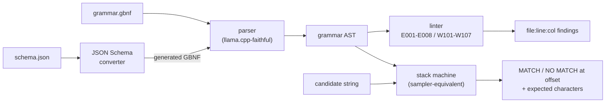

# gbnf-doctor

[English](README.md) | [中文](README.zh.md) | [日本語](README.ja.md)

[](LICENSE)   [](CONTRIBUTING.md)

**オープンソースの GBNF グラマードクター —— モデルをロードせずに llama.cpp 文法を lint し、文字列でテストし、JSON Schema を GBNF に変換。完全オフライン・依存ゼロ。**


```bash
# not yet on npm — install from a checkout of this repository
npm install && npm run build && npm pack
npm install -g ./gbnf-doctor-0.1.0.tgz
```

## なぜ gbnf-doctor？

GBNF は llama.cpp が生成を制約する仕組みであり、壊れた文法は*音もなく*失敗する：サンプラーはモデルをゴミ出力へ誘導し、途中で行き止まりに入り、あるいは永遠に止まらない —— そして今日の唯一のデバッグ手段は、起動済みモデル相手の試行錯誤だ。既存ツールは llama.cpp の内部にしかない：`llama-gbnf-validator` サンプルは文字列を検査できるがプロジェクト全体のビルドが必要で、schema 変換器は lint を一切せずに文法を吐くだけ。gbnf-doctor はこのループ全体を推論スタックから切り出した：**lint** は 24 個の安定コードと did-you-mean ヒントで、ロード即死の問題（未定義規則、左再帰、`root` 欠落）とサイレントな問題（到達不能規則、空文字列を受理する文法、停止を強制しない繰り返し）を捕まえる；**test** はサンプラーと同じスタックマシンを再現し、拒否時にはオフセットと、その位置で文法が受理し得た文字集合を表示する；**convert** は JSON Schema を、同梱 linter を必ず通過する文法へ変換する。すべてミリ秒で、GGUF ファイルを一度も見たことのないマシン上で完結する。

|  | gbnf-doctor | llama-gbnf-validator | json_schema_to_grammar.py | モデル相手の試行錯誤 |
|---|---|---|---|---|
| 文法の lint（静的ルール） | 24 コード | なし（構文エラーのみ） | なし | なし |
| オフラインで文字列テスト | あり、期待集合つき診断 | あり、llama.cpp のビルドが必要 | なし | GPU + モデル + プロンプトが必要 |
| JSON Schema から GBNF | あり、構成上 lint クリーン | なし | あり、lint なし | 該当なし |
| エラー位置 + 修正ヒント | 行:列 + did-you-mean | おおまか | スタックトレース | なし |
| インストールの重さ | Node.js のみ、依存 0 | llama.cpp ツールチェーン一式 | Python + llama.cpp チェックアウト | 数 GB の重み |

<sub>機能比較は llama.cpp リポジトリ（grammars/ と examples/、2026-07）で確認；validator と変換器はツリー内ツールであり、独立パッケージとしては配布されていない。</sub>

## 特徴

- **3 つの動詞、1 つのエンジン** —— `lint`・`test`・`convert` は同一のパーサーと文法モデルを共有し、linter・マッチャー・生成器が文法の意味について食い違うことはあり得ない。
- **llama.cpp に忠実なパース** —— 同じ改行規則（`::=` 後の改行継続、括弧グループの複数行、行末 `|` による選択肢継続）、同じエスケープ集合、同じ繰り返し結合（`"ab"*` はリテラル全体を繰り返す）、同じ後勝ち定義セマンティクス；このツールが受理する文法はランタイムも受理する。
- **24 個の安定診断コード** —— 修正ヒントつき構文エラー 9 個（P001–P009）、ランタイム拒否または永久不一致を意味するエラー 8 個（E001–E008）、ロードはできるが誤動作する文法への警告 7 個（W101–W107）；コードの意味は不変なので CI で直接照合できる。
- **行動につながる拒否レポート** —— `test` は受理不能になった最初の文字の正確なオフセット・行・列、実際に読んだ文字、そしてその位置で文法が期待した文字のマージ済み集合を報告する；`--prefix-ok` は成長途中のストリーミング出力の検証に使える。
- **証拠つき schema 変換** —— 生成された文法はすべて構成上同梱 linter を通過し、空白と数字列には上限があるためモデルは埋め草で文法を満たし続けられず、未対応キーワードは黙って捨てられる代わりに明示的な note になる。
- **ランタイム依存ゼロ、完全オフライン** —— 必要なのは Node.js だけ；ツールはソケットを一切開かず、devDependency は `typescript` のみ。

## クイックスタート

インストール：

```bash
# not yet on npm — install from a checkout of this repository
npm install && npm run build && npm pack
npm install -g ./gbnf-doctor-0.1.0.tgz
```

古典的ミスを詰め込んだ文法を lint する（サンプルとして同梱）：

```bash
gbnf-doctor lint examples/broken.gbnf
```

出力（実測ラン、要点を抜粋）：

```text
examples/broken.gbnf:6:21: error E002 undefined rule "vlaue" (did you mean "value"?)
examples/broken.gbnf:9:1: warning W101 rule "helper" is defined but unreachable from "root"
examples/broken.gbnf:10:1: error E004 left recursion detected (expr -> expr) — llama.cpp rejects left-recursive grammars at load time; rewrite with right recursion or repetition
examples/broken.gbnf: FAIL (3 errors, 4 warnings)
```

文字列で文法をテストする —— モデルなし、文字単位の診断（実測ラン）：

```bash
gbnf-doctor test examples/ipv4.gbnf "192.168.0.1" "256.1.1.1" "10.0"
```

```text
examples/ipv4.gbnf: MATCH "192.168.0.1"
examples/ipv4.gbnf: NO MATCH "256.1.1.1" — at offset 2 (line 1, col 3): got "6", expected "." or "0"-"5"
examples/ipv4.gbnf: INCOMPLETE "10.0" — valid prefix, but the grammar expects more: "."
```

JSON Schema を変換し、残る 2 つの動詞で結果を往復検証する（実測ラン、要点を抜粋）：

```bash
gbnf-doctor convert examples/ticket.schema.json
```

```text
root ::= "{" ws "\"id\"" ws ":" ws uuid "," ws "\"title\"" ws ":" ws title "," ws "\"priority\"" ws ":" ws priority "," ws "\"resolved\"" ws ":" ws boolean ( "," ws "\"tags\"" ws ":" ws tags )? ( "," ws "\"assignee\"" ws ":" ws assignee )? "}" ws
ws ::= [ \t\n\r]{0,16}
uuid ::= "\"" hex{8} "-" hex{4} "-" hex{4} "-" hex{4} "-" hex{12} "\"" ws
title ::= "\"" string-char{1,80} "\"" ws
priority ::= ( "\"low\"" ws | "\"normal\"" ws | "\"high\"" ws | "\"urgent\"" ws )
```

より多くのシナリオは [examples/](examples/README.md) に。

## 診断

エラーは llama.cpp が文法を拒否するか永久に一致しないことを意味し、警告はロードはできてもほぼ確実に誤動作することを意味する。各ルールの完全な根拠は [docs/rules.md](docs/rules.md) に。

| コード | 重大度 | 捕捉内容 |
|---|---|---|
| P001–P009 | 構文エラー | 構文問題。行頭 `\|`・`\-` エスケープ・迷子の `::=` への修正ヒントつき |
| E001–E004 | エラー | `root` 欠落、未定義規則（did-you-mean）、重複定義、左再帰 |
| E005–E008 | エラー | 空文字クラス、逆転レンジ、`{3,2}` 境界、マッチを完了できない規則 |
| W101–W104 | 警告 | 到達不能規則、空文字列を受理する文法、重複選択肢、文字クラスの重なり |
| W105–W107 | 警告 | 空マッチでループする繰り返し、空リテラル、停止を強制しない末尾繰り返し |

## 終了コードとスクリプト連携

全サブコマンドが同じ契約を共有するので、2 行の CI ステップで文法変更にゲートを置ける：`0` 正常、`1` 検出あり・文字列拒否（`--strict` は警告と変換 note も失敗へ昇格）、`2` 用法・I/O・入力エラー —— `test` に渡された壊れた文法は `2` であり、偽の「不一致」にはならない。構造化出力を持つコマンドはすべて `--format json` に対応。

| コマンド | 主なフラグ | 効果 |
|---|---|---|
| `lint <g.gbnf>` | `--strict`・`--format json` | 警告でも失敗；機械可読な検出リスト |
| `test <g.gbnf> [s...]` | `--file`・`--stdin`・`--chomp`・`--prefix-ok` | ファイル/パイプから候補を読む；末尾改行を 1 つ除去；正当な接頭辞を受理 |
| `convert <s.json>` | `--out`・`--compact`・`--strict` | ファイルへ書き出し；空白規則を省略；未対応キーワードで失敗 |

対応する JSON Schema サブセット（および「note を出して無視」する正直なリスト）は [docs/schema-support.md](docs/schema-support.md) に記載。

## アーキテクチャ



## ロードマップ

- [x] 忠実なパーサー、24 コード linter、サンプラー等価の文字列テスター、lint クリーン保証つき JSON Schema 変換器、JSON 出力、90 テスト（v0.1.0）
- [ ] 変換器の `pattern` 対応：安全な正規表現から GBNF へのサブセット
- [ ] 桁レンジ展開による数値 `minimum`/`maximum` 対応
- [ ] `fmt` サブコマンド：正規フォーマットと、安全な検出への機械的 `--fix`
- [ ] `sample` サブコマンド：文法からランダム文字列を生成してカバレッジを目視確認

全リストは [open issues](https://github.com/JaydenCJ/gbnf-doctor/issues) を参照。

## コントリビュート

貢献を歓迎します。`npm install && npm run build` でビルドし、`npm test` と `bash scripts/smoke.sh`（`SMOKE OK` を表示すること）を実行してください —— 本リポジトリは CI を持たず、上記の主張はすべてローカル実行で検証されています。[CONTRIBUTING.md](CONTRIBUTING.md) を読み、[good first issue](https://github.com/JaydenCJ/gbnf-doctor/issues?q=is%3Aissue+is%3Aopen+label%3A%22good+first+issue%22) を選ぶか、[discussion](https://github.com/JaydenCJ/gbnf-doctor/discussions) を始めてください。

## ライセンス

[MIT](LICENSE)
