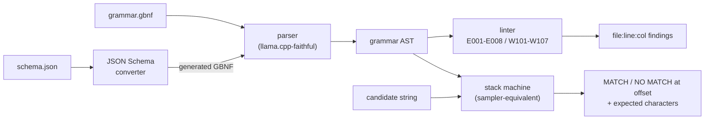

# gbnf-doctor

[English](README.md) | [中文](README.zh.md) | [日本語](README.ja.md)

[](LICENSE)   [](CONTRIBUTING.md)

**An open-source grammar doctor for GBNF — lint llama.cpp grammars, test strings against them without loading a model, and convert JSON Schema to GBNF, fully offline and dependency-free.**


```bash
# not yet on npm — install from a checkout of this repository
npm install && npm run build && npm pack
npm install -g ./gbnf-doctor-0.1.0.tgz
```

## Why gbnf-doctor?

GBNF is how llama.cpp constrains generation, and a bad grammar fails *silently*: the sampler just steers the model into garbage, dead-ends mid-sequence, or never stops — and the only debugging workflow today is trial and error against a running model. The tooling that does exist lives inside llama.cpp itself: the `llama-gbnf-validator` example can check a string but requires building the whole project, and the schema converter generates grammars without ever linting them. gbnf-doctor pulls that entire loop out of the inference stack: **lint** catches the load-time killers (undefined rules, left recursion, missing `root`) and the silent ones (unreachable rules, grammars that accept the empty string, repetitions that never force a stop) with 24 stable codes and did-you-mean hints; **test** replays the exact stack machine the sampler uses and, on rejection, prints the offset plus the characters the grammar would have accepted; **convert** turns JSON Schema into a grammar that is guaranteed to pass the bundled linter. All of it in milliseconds, on a machine that has never seen a GGUF file.

|  | gbnf-doctor | llama-gbnf-validator | json_schema_to_grammar.py | trial and error vs a model |
|---|---|---|---|---|
| Lints grammars (static rules) | 24 codes | no (parse errors only) | no | no |
| Tests strings offline | yes, with expected-set diagnosis | yes, needs a llama.cpp build | no | needs GPU + model + prompt |
| JSON Schema to GBNF | yes, lint-clean by construction | no | yes, unlinted | n/a |
| Error positions + fix-it hints | line:col + did-you-mean | approximate | stack trace | none |
| Install footprint | Node.js only, 0 deps | full llama.cpp toolchain | Python + llama.cpp checkout | GBs of weights |

<sub>Capability claims checked against the llama.cpp repository (grammars/ and examples/, 2026-07); the validator and converter ship as in-tree tools, not standalone packages.</sub>

## Features

- **Three verbs, one engine** — `lint`, `test` and `convert` share a single parser and grammar model, so the linter, the matcher and the generator can never disagree about what a grammar means.
- **llama.cpp-faithful parsing** — the same newline rules (`::=` line continuation, groups spanning lines, trailing-`|` alternation), the same escape set, the same repetition binding (`"ab"*` repeats the whole literal), the same last-definition-wins semantics; grammars this tool accepts, the runtime accepts.
- **24 stable diagnostic codes** — 9 parse errors with fix-it hints (P001–P009), 8 errors that mean the runtime rejects or the grammar can never match (E001–E008), 7 warnings for grammars that load but misbehave (W101–W107); codes never change meaning, so CI can match on them.
- **Rejections you can act on** — `test` reports the exact offset, line and column of the first impossible character, what it got, and the merged set of characters the grammar expected there; `--prefix-ok` validates streamed, still-growing output.
- **Schema conversion with receipts** — every generated grammar passes the bundled linter by construction, whitespace and digit runs are bounded so a model can never pad forever, and unsupported keywords become explicit notes instead of silent drops.
- **Zero runtime dependencies, fully offline** — Node.js is the only requirement; the tool never opens a socket, and `typescript` is the sole devDependency.

## Quickstart

Install:

```bash
# not yet on npm — install from a checkout of this repository
npm install && npm run build && npm pack
npm install -g ./gbnf-doctor-0.1.0.tgz
```

Lint a grammar with the classic mistakes (bundled as an example):

```bash
gbnf-doctor lint examples/broken.gbnf
```

Output (real captured run, abridged to the highlights):

```text
examples/broken.gbnf:6:21: error E002 undefined rule "vlaue" (did you mean "value"?)
examples/broken.gbnf:9:1: warning W101 rule "helper" is defined but unreachable from "root"
examples/broken.gbnf:10:1: error E004 left recursion detected (expr -> expr) — llama.cpp rejects left-recursive grammars at load time; rewrite with right recursion or repetition
examples/broken.gbnf: FAIL (3 errors, 4 warnings)
```

Test strings against a grammar — no model, exact diagnosis (real captured run):

```bash
gbnf-doctor test examples/ipv4.gbnf "192.168.0.1" "256.1.1.1" "10.0"
```

```text
examples/ipv4.gbnf: MATCH "192.168.0.1"
examples/ipv4.gbnf: NO MATCH "256.1.1.1" — at offset 2 (line 1, col 3): got "6", expected "." or "0"-"5"
examples/ipv4.gbnf: INCOMPLETE "10.0" — valid prefix, but the grammar expects more: "."
```

Convert a JSON Schema and round-trip it through the other two verbs (real captured run, abridged to the highlights):

```bash
gbnf-doctor convert examples/ticket.schema.json
```

```text
root ::= "{" ws "\"id\"" ws ":" ws uuid "," ws "\"title\"" ws ":" ws title "," ws "\"priority\"" ws ":" ws priority "," ws "\"resolved\"" ws ":" ws boolean ( "," ws "\"tags\"" ws ":" ws tags )? ( "," ws "\"assignee\"" ws ":" ws assignee )? "}" ws
ws ::= [ \t\n\r]{0,16}
uuid ::= "\"" hex{8} "-" hex{4} "-" hex{4} "-" hex{4} "-" hex{12} "\"" ws
title ::= "\"" string-char{1,80} "\"" ws
priority ::= ( "\"low\"" ws | "\"normal\"" ws | "\"high\"" ws | "\"urgent\"" ws )
```

More scenarios live in [examples/](examples/README.md).

## Diagnostics

Errors mean llama.cpp refuses the grammar or it can never match; warnings mean it loads but almost certainly misbehaves. Full rationale per rule in [docs/rules.md](docs/rules.md).

| Codes | Severity | Catch |
|---|---|---|
| P001–P009 | parse error | syntax, with fix-it hints for leading-`\|` lines, `\-` escapes and stray `::=` |
| E001–E004 | error | missing `root`, undefined rules (did-you-mean), duplicate definitions, left recursion |
| E005–E008 | error | empty classes, reversed ranges, `{3,2}` bounds, rules that can never finish |
| W101–W104 | warning | unreachable rules, empty-string grammars, duplicate alternatives, overlapping classes |
| W105–W107 | warning | repetition-over-empty loops, empty literals, trail-off repetitions that never force a stop |

## Exit codes and scripting

All subcommands share the same contract, so a two-line CI step can gate grammar changes: `0` ok, `1` findings or rejected strings (`--strict` promotes warnings and converter notes), `2` usage, I/O or input errors — a broken grammar passed to `test` is a `2`, not a false "no match". Every command takes `--format json` where output is structured.

| Command | Key flags | Effect |
|---|---|---|
| `lint <g.gbnf>` | `--strict`, `--format json` | fail on warnings too; machine-readable findings |
| `test <g.gbnf> [s...]` | `--file`, `--stdin`, `--chomp`, `--prefix-ok` | candidates from files/pipes; strip one trailing newline; accept valid prefixes |
| `convert <s.json>` | `--out`, `--compact`, `--strict` | write to a file; drop whitespace rules; fail on unsupported keywords |

The JSON Schema subset (and the honest list of what is noted-and-ignored) is documented in [docs/schema-support.md](docs/schema-support.md).

## Architecture



## Roadmap

- [x] Faithful parser, 24-code linter, sampler-equivalent string tester, JSON Schema converter with lint-clean guarantee, JSON output, 90 tests (v0.1.0)
- [ ] `pattern` support in the converter via a safe regex-to-GBNF subset
- [ ] numeric `minimum`/`maximum` via digit-range expansion
- [ ] `fmt` subcommand: canonical formatting plus mechanical `--fix` for safe findings
- [ ] `sample` subcommand: generate random strings from a grammar for eyeballing coverage

See the [open issues](https://github.com/JaydenCJ/gbnf-doctor/issues) for the full list.

## Contributing

Contributions are welcome. Build with `npm install && npm run build`, then run `npm test` and `bash scripts/smoke.sh` (must print `SMOKE OK`) — this repository ships no CI, every claim above is verified by local runs. See [CONTRIBUTING.md](CONTRIBUTING.md), grab a [good first issue](https://github.com/JaydenCJ/gbnf-doctor/issues?q=is%3Aissue+is%3Aopen+label%3A%22good+first+issue%22), or start a [discussion](https://github.com/JaydenCJ/gbnf-doctor/discussions).

## License

[MIT](LICENSE)
