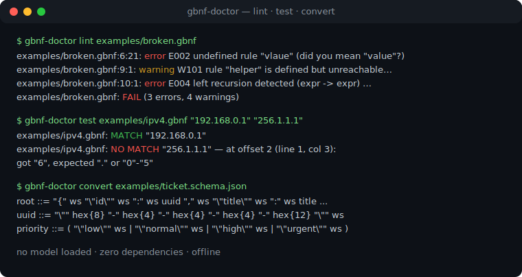
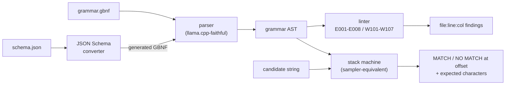

# gbnf-doctor

[English](README.md) | [中文](README.zh.md) | [日本語](README.ja.md)

[](LICENSE)   [](CONTRIBUTING.md)

**开源的 GBNF 语法医生 —— 无需加载模型即可 lint llama.cpp 语法、用字符串测试语法，并把 JSON Schema 转换为 GBNF，完全离线、零依赖。**



```bash
# not yet on npm — install from a checkout of this repository
npm install && npm run build && npm pack
npm install -g ./gbnf-doctor-0.1.0.tgz
```

## 为什么选 gbnf-doctor？

GBNF 是 llama.cpp 约束生成的机制，而一个坏语法会*悄无声息地*失败：采样器把模型引向垃圾输出、中途走进死胡同、或者永远停不下来 —— 如今唯一的调试流程就是对着一个跑起来的模型反复试错。现有的工具都住在 llama.cpp 里面：`llama-gbnf-validator` 示例能检查字符串却要求编译整个项目，schema 转换器只管生成语法、从不做任何 lint。gbnf-doctor 把整个调试环从推理栈里拆了出来：**lint** 用 24 个稳定代码和 did-you-mean 提示抓出加载即死的问题（未定义规则、左递归、缺失 `root`）和无声的问题（不可达规则、接受空串的语法、永不强制停止的重复）；**test** 复现采样器所用的栈机器，拒绝时打印偏移量以及语法在那里本可接受的字符集合；**convert** 把 JSON Schema 变成保证能通过自带 linter 的语法。这一切都在毫秒内完成，机器上连一个 GGUF 文件都不需要。

|  | gbnf-doctor | llama-gbnf-validator | json_schema_to_grammar.py | 对着模型试错 |
|---|---|---|---|---|
| lint 语法（静态规则） | 24 个代码 | 否（仅解析错误） | 否 | 否 |
| 离线测试字符串 | 是，带期望集诊断 | 是，需编译 llama.cpp | 否 | 需要 GPU + 模型 + 提示词 |
| JSON Schema 转 GBNF | 是，构造即通过 lint | 否 | 是，未经 lint | 不适用 |
| 错误位置 + 修复提示 | 行:列 + did-you-mean | 粗略 | 堆栈跟踪 | 无 |
| 安装体积 | 仅 Node.js，0 依赖 | 完整 llama.cpp 工具链 | Python + llama.cpp 检出 | 数 GB 的权重 |

<sub>能力对比核对自 llama.cpp 仓库（grammars/ 与 examples/，2026-07）；validator 和转换器都是树内工具，并非独立发布的包。</sub>

## 功能

- **三个动词，一套引擎** —— `lint`、`test`、`convert` 共享同一个解析器和语法模型，linter、匹配器和生成器对语法含义永远不会各说各话。
- **忠实于 llama.cpp 的解析** —— 相同的换行规则（`::=` 换行续写、括号组跨行、行尾 `|` 续接选择支）、相同的转义集合、相同的重复绑定（`"ab"*` 重复整个字面量）、相同的后定义覆盖语义；本工具接受的语法，运行时也接受。
- **24 个稳定诊断代码** —— 9 个带修复提示的解析错误（P001–P009）、8 个意味着运行时拒绝或语法永不匹配的错误（E001–E008）、7 个针对能加载但会出问题的语法的警告（W101–W107）；代码含义永不变更，CI 可以直接匹配。
- **可以直接行动的拒绝报告** —— `test` 报告第一个无法接受的字符的精确偏移、行列位置、实际读到的字符，以及语法在那里期望的字符合并集合；`--prefix-ok` 用于校验仍在增长的流式输出。
- **有凭据的 schema 转换** —— 每个生成的语法构造即通过自带 linter，空白与数字串都有上界、模型永远无法靠填充混过语法，不支持的关键字变成显式 note 而不是被静默丢弃。
- **零运行时依赖，完全离线** —— 只需要 Node.js；工具从不打开套接字，`typescript` 是唯一的 devDependency。

## 快速上手

安装：

```bash
# not yet on npm — install from a checkout of this repository
npm install && npm run build && npm pack
npm install -g ./gbnf-doctor-0.1.0.tgz
```

lint 一个集齐经典错误的语法（已内置为示例）：

```bash
gbnf-doctor lint examples/broken.gbnf
```

输出（真实运行捕获，节选要点）：

```text
examples/broken.gbnf:6:21: error E002 undefined rule "vlaue" (did you mean "value"?)
examples/broken.gbnf:9:1: warning W101 rule "helper" is defined but unreachable from "root"
examples/broken.gbnf:10:1: error E004 left recursion detected (expr -> expr) — llama.cpp rejects left-recursive grammars at load time; rewrite with right recursion or repetition
examples/broken.gbnf: FAIL (3 errors, 4 warnings)
```

用字符串测试语法 —— 不加载模型，诊断精确到字符（真实运行捕获）：

```bash
gbnf-doctor test examples/ipv4.gbnf "192.168.0.1" "256.1.1.1" "10.0"
```

```text
examples/ipv4.gbnf: MATCH "192.168.0.1"
examples/ipv4.gbnf: NO MATCH "256.1.1.1" — at offset 2 (line 1, col 3): got "6", expected "." or "0"-"5"
examples/ipv4.gbnf: INCOMPLETE "10.0" — valid prefix, but the grammar expects more: "."
```

转换 JSON Schema，并让另外两个动词对结果做闭环验证（真实运行捕获，节选要点）：

```bash
gbnf-doctor convert examples/ticket.schema.json
```

```text
root ::= "{" ws "\"id\"" ws ":" ws uuid "," ws "\"title\"" ws ":" ws title "," ws "\"priority\"" ws ":" ws priority "," ws "\"resolved\"" ws ":" ws boolean ( "," ws "\"tags\"" ws ":" ws tags )? ( "," ws "\"assignee\"" ws ":" ws assignee )? "}" ws
ws ::= [ \t\n\r]{0,16}
uuid ::= "\"" hex{8} "-" hex{4} "-" hex{4} "-" hex{4} "-" hex{12} "\"" ws
title ::= "\"" string-char{1,80} "\"" ws
priority ::= ( "\"low\"" ws | "\"normal\"" ws | "\"high\"" ws | "\"urgent\"" ws )
```

更多场景见 [examples/](examples/README.md)。

## 诊断

错误意味着 llama.cpp 拒绝该语法或它永不匹配；警告意味着能加载但几乎必然出问题。每条规则的完整依据见 [docs/rules.md](docs/rules.md)。

| 代码 | 级别 | 捕捉内容 |
|---|---|---|
| P001–P009 | 解析错误 | 语法问题，附带针对行首 `\|`、`\-` 转义和游离 `::=` 的修复提示 |
| E001–E004 | 错误 | 缺失 `root`、未定义规则（did-you-mean）、重复定义、左递归 |
| E005–E008 | 错误 | 空字符类、颠倒的区间、`{3,2}` 边界、永远无法匹配完的规则 |
| W101–W104 | 警告 | 不可达规则、接受空串的语法、重复选择支、字符类成员重叠 |
| W105–W107 | 警告 | 空匹配循环的重复、空字面量、永不强制停止的收尾重复 |

## 退出码与脚本化

所有子命令共享同一约定，两行 CI 脚本即可给语法变更设卡：`0` 正常，`1` 有发现或字符串被拒（`--strict` 把警告和转换 note 也升级为失败），`2` 用法、I/O 或输入错误 —— 传给 `test` 的坏语法返回 `2`，而不是伪装成"不匹配"。所有有结构化输出的命令都支持 `--format json`。

| 命令 | 关键旗标 | 效果 |
|---|---|---|
| `lint <g.gbnf>` | `--strict`、`--format json` | 警告也算失败；机器可读的发现列表 |
| `test <g.gbnf> [s...]` | `--file`、`--stdin`、`--chomp`、`--prefix-ok` | 从文件/管道读取候选；去掉一个尾部换行；接受合法前缀 |
| `convert <s.json>` | `--out`、`--compact`、`--strict` | 写入文件；去掉空白规则；遇到不支持的关键字即失败 |

支持的 JSON Schema 子集（以及"记 note 后忽略"的诚实清单）记录在 [docs/schema-support.md](docs/schema-support.md)。

## 架构



## 路线图

- [x] 忠实解析器、24 代码 linter、等价于采样器的字符串测试器、带 lint-clean 保证的 JSON Schema 转换器、JSON 输出、90 个测试（v0.1.0）
- [ ] 转换器支持 `pattern`：安全的正则到 GBNF 子集
- [ ] 通过数位区间展开支持数值 `minimum`/`maximum`
- [ ] `fmt` 子命令：规范化格式，外加对安全发现的机械 `--fix`
- [ ] `sample` 子命令：从语法随机生成字符串，肉眼检查覆盖面

完整列表见 [open issues](https://github.com/JaydenCJ/gbnf-doctor/issues)。

## 参与贡献

欢迎贡献。用 `npm install && npm run build` 构建，然后运行 `npm test` 和 `bash scripts/smoke.sh`（必须打印 `SMOKE OK`）—— 本仓库不带 CI，上文的每一条主张都由本地运行验证。参见 [CONTRIBUTING.md](CONTRIBUTING.md)，认领一个 [good first issue](https://github.com/JaydenCJ/gbnf-doctor/issues?q=is%3Aissue+is%3Aopen+label%3A%22good+first+issue%22)，或发起一场 [discussion](https://github.com/JaydenCJ/gbnf-doctor/discussions)。

## 许可证

[MIT](LICENSE)
